# 通用登录模块

## 目录
- [通用登录模块](#通用登录模块)
   * [目录](#目录)
   * [概述](#概述)
   * [项目进度](#项目进度)
      + [✅ over](#over)
      + [🎯 Todo List](#todo-list)
   * [技术栈](#技术栈)
      + [前端](#前端)
      + [后端](#后端)
   * [功能介绍](#功能介绍)
      + [注册](#注册)
         - [图形验证码](#图形验证码)
            * [谷歌开源 kaptcha 图形验证码](#谷歌开源-kaptcha-图形验证码)
            * [功能流程图](#功能流程图)
            * [问题：为什么 key 使用 ip 地址+浏览器指纹？](#问题为什么-key-使用-ip-地址浏览器指纹)
         - [邮箱验证码](#邮箱验证码)
            * [架构图](#架构图)
            * [功能流程图](#功能流程图-1)
            * [注册邮箱唯一性保证方案](#注册邮箱唯一性保证方案)
      + [登录](#登录)
         - [邮箱密码登录](#邮箱密码登录)
      + [验证码接口限流](#验证码接口限流)
         - [背景](#背景)
         - [常见的方案](#常见的方案)
         - [时间滑动窗口](#时间滑动窗口)
            * [实现思路](#实现思路)
            * [代码实现](#代码实现)
      + [找回密码](#找回密码)
   * [参考资料](#参考资料)


## 概述
这是一个通用登录模块，用于实现用户登录、注册、找回密码等功能。

## 项目进度
### ✅over
1. 登录功能 
2. 注册功能

### 🎯Todo List
1. 找回密码

## 技术栈
### 前端
| 技术栈              | 描述                                         |
|------------------|--------------------------------------------|
| **Vue 3**        | 现代化渐进式前端框架，支持 Composition API，性能更优，代码更清晰。  |
| **Vue Router**   | Vue 官方的路由管理库，支持动态路由、嵌套路由、懒加载等功能。           |
| **Pinia**        | Vue 3 官方推荐的状态管理库，替代 Vuex，类型推导更好，使用更简单。     |
| **Element Plus** | 基于 Vue 3 的组件库（Element UI 的升级版），提供丰富的 UI 组件。 |
| **TypeScript**   | JavaScript 的超集，提供类型系统和开发时错误提示，提升代码健壮性与可维护性。 |
| **Axios**        | 基于Promise的HTTP库，用于前端与后端的数据交互。              |
| **Nodejs-20**    |                                            |

### 后端
| 技术栈           | 描述                                                   |
| ------------- | ---------------------------------------------------- |
| **Spring Boot 3** | 基于 Spring Framework 的快速开发框架，支持最新 Jakarta EE 标准和原生支持 AOT。 |
| **JDK 17**    | Java LTS（长期支持）版本，提供更强的性能、语法优化和安全特性。                  |
| **Redis**     | 高性能内存数据库，常用于缓存、限流、分布式锁等场景。                           |
| **MySQL**     | 主流关系型数据库，适用于大多数业务场景。                                 |
| **MyBatis-Plus** | MyBatis 的增强版，简化了 CRUD 操作，支持分页、条件构造器等功能。              |
| **Sa-Token**  | 轻量级权限认证框架，支持登录、权限、单点登录、踢人下线、Token 续签等功能。             |


## 功能介绍
### 注册

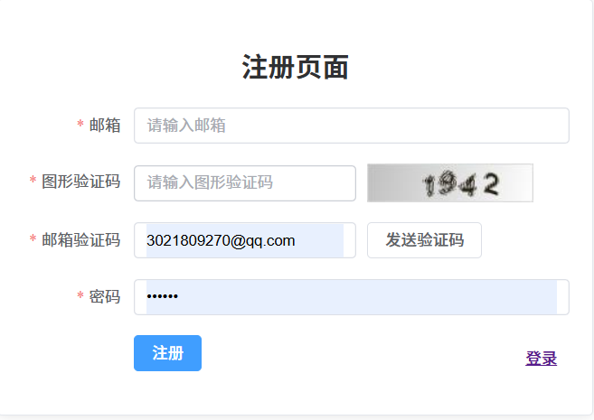

首先，我们设计了“用户信息表”，包含了用户的账号、密码、邮箱、邮箱号等字段。

```sql
CREATE TABLE sys_user
(
    id          BIGINT PRIMARY KEY AUTO_INCREMENT,
    username    VARCHAR(50)  NOT NULL UNIQUE COMMENT '用户名',
    email       VARCHAR(100) NOT NULL UNIQUE COMMENT '邮箱',
    password    VARCHAR(255) NOT NULL COMMENT '加密后的密码',
    account     VARCHAR(50)  NOT NULL COMMENT '账号',
    salt        VARCHAR(50) COMMENT '用于加盐加密',
    phone       VARCHAR(20) COMMENT '邮箱号',
    status      TINYINT  DEFAULT 1 COMMENT '状态：0=禁用，1=启用',
    create_time DATETIME DEFAULT CURRENT_TIMESTAMP COMMENT '创建时间',
    update_time DATETIME DEFAULT CURRENT_TIMESTAMP ON UPDATE CURRENT_TIMESTAMP COMMENT '更新时间'
);
```
这个流程主要涉及到 2 个接口，分别是：
1. 图片验证码接口
2. 邮箱验证码发送接口


#### 图形验证码
##### 谷歌开源 kaptcha 图形验证码
Kaptcha 框架是由 Google 开源的一款高度可定制的验证码生成解决方案，它提供了广泛的配置选项以满足不同安全需求和视觉设计要求，具体包括但不限于：

1. 验证码的看起来的样子，包括字怎么写（字体）、字的大小和颜色
2. 验证码里能出现的内容是啥，比如数字、字母、还是中文汉字
3. 验证码图片的大小，以及图片边缘的线条（边框）的宽度、样子和颜色
4. 。。。。。其他效果

引入 maven 依赖

```xml
<dependency>
  <groupId>com.baomidou</groupId>
  <artifactId>kaptcha-spring-boot-starter</artifactId>
  <version>${kaptcha.version}</version>
</dependency>
```

##### 功能流程图

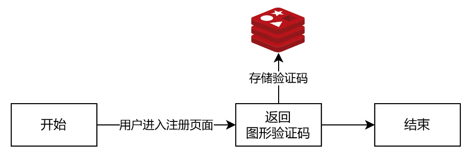

1. 用户进入注册页面，获取图形验证码
2. 保存验证码到 Redis
3. key  =`system:register:captcha:MD5加密(ip 地址+浏览器指纹)`，过期时间 10 分钟。
4. 为后续发送邮箱短信做校验。

##### 问题-为什么 key 使用 ip 地址+浏览器指纹？
1. 使用 ip 地址：让后台正确识别验证码发送到哪个浏览器。
2. 浏览器指纹：有些地方的小区或者学校，出口 ip 是共用的，容易造成验证码错发问题。

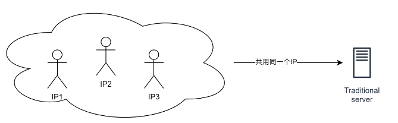

3. 使用`用户IP + 浏览器指纹`，虽然也会又问题，但是很大程度上避免了冲突

> **Key命名规范**：
>1. **标准化命名约定**：采用业务前缀与冒号分隔符来清晰界定键值空间
  >1. 如`service-name:bisu:category:key-detail`。
>   2. 示例：`system:register:captcha:identifier`
> 3. **长度限制**：确保Key名称长度合理，避免过长导致的网络传输与存储开销。


#### 邮箱验证码
送邮箱验证码教程：[springboot（07）邮件发送（qq邮箱）](https://blog.csdn.net/Bilal_0/article/details/129938629?ops_request_misc=%257B%2522request%255Fid%2522%253A%2522ef45b1ab9cd69988019c8c62c11a0864%2522%252C%2522scm%2522%253A%252220140713.130102334..%2522%257D&request_id=ef45b1ab9cd69988019c8c62c11a0864&biz_id=0&utm_medium=distribute.pc_search_result.none-task-blog-2~all~top_positive~default-1-129938629-null-null.142^v102^pc_search_result_base6&utm_term=springboot%E5%8F%91%E9%80%81qq%E9%82%AE%E4%BB%B6&spm=1018.2226.3001.4187)

> 邮箱验证码教程 : [聚美智数短信验证码-API专区-云市场](https://market.aliyun.com/apimarket/detail/cmapi00046920?spm=5176.2020520132.101.5.279672188jDvlT#sku=yuncode4092000009)

##### 架构图

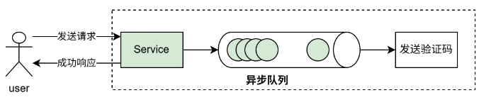

发送验证码”功能使用异步处理机制，实现消息异步发送，快速响应用户，工作流程如下：
1. 前端：用户发送请求
2. 后端：接收请求，将消息添加到“异步队列”
3. 响应用户

**异步机制** :解决了在高并发场景时，同一时刻大量用户请求，导致请求部分用户请求超时异常，如下图所示：

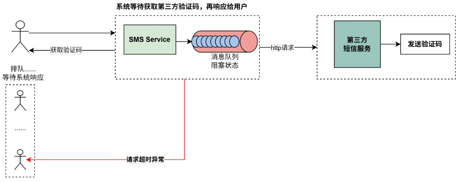

1. **消息队列阻塞**：若在短时间内有大量用户同时发起请求，而其中某个请求的处理时间较长，这将导致其他请求在队列中积压，系统性能下降。
2. **请求超时**：一旦请求堆积的数量超过了服务程序能够处理的等待时间限制，系统便会抛出“connection timed out”的错误，从而影响用户体验，造成服务质量的下降。

##### 功能流程图

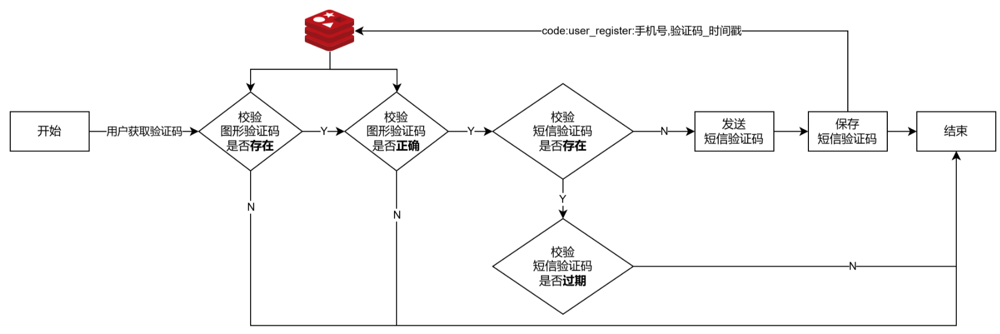

1. 用户输入图形验证码，点击获取邮箱验证码按钮，发送请求。
2. 前端限制用户 60 秒只能发送一次请求。
3. Redis 中获取图形验证码
   1. 校验图形验证码是否存在
   2. 不存在，说明过期，则重新获取图形验证码
   3. 存在，校验图形验证码是否正确
      1. 校验邮箱号是否正确（11 位数，数字）
         1. 正确，从 Redis 中删除图形验证码
4. 校验本次“邮箱验证码”是否存在
   1. 存在，判断验证码是否超过 60 秒
      1. 未超过，不发送短信验证码
      2. 超过，发送短信验证码，保存验证码到 Redis。
   2. 不存在，发送短信验证码，保存验证码到 Redis。
5. 保存邮箱验证码到 Redis，`{code:user_register:邮箱，验证码_时间戳}`，过期时间 10 分钟
6. 响应用户发送成功。

##### 注册邮箱唯一性保证方案
> ⚠️**高并发问题**
>
> 1. 万分之一的时间，放大100万倍
> 2. 不是你的代码安全，而是你的并发量过少，几个几十个并发量发现不了问题
> 3. 几十万几百万并发，线下难模拟
>    1. 代码暂停思维：假如非原子性代码运行到某一行暂停，其他线程重新操作是否会出问题
>    2. 时间扩大思维：1纳秒的时间，扩大到1分钟，代码逻辑是否会有问题。

**注册业务**：
1. 需要保证注册收的邮箱在数据库中唯一。
2. 一个账号只能有一个邮箱，但邮箱可以修改（账号换绑邮箱）。


---

### 登录
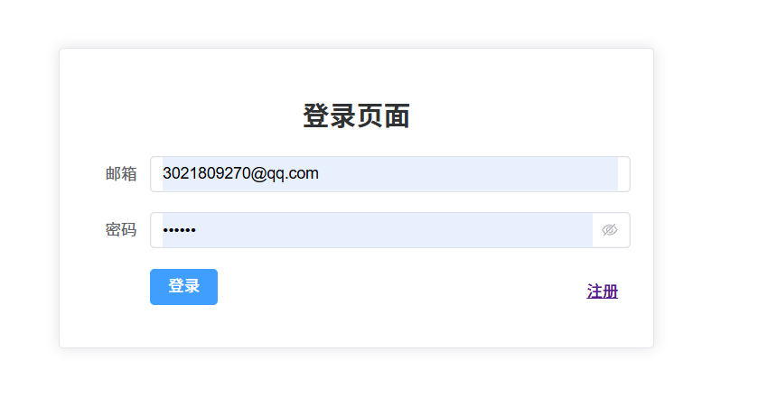

#### 邮箱密码登录
1. **发送请求**：当前端提交请求时，请求体中以 JSON 形式提交账号、密码、验证码这几个参数。
2. **参数校验**：对于“登录请求”时不需要校验 Token 的，所以直接放行。 请求被转发到 user 用户服务这里，流程也很简单。
   1. 先针对参数进行校验，非空、是否合法
      1. 如果参数有问题，则直接返回登录失败信息。
   2. 如果没有限流，就查询用户数据，用户是否存在，如果不存在就返回登录失败
   3. 如果存在，就校验密码，我们是使用加随机盐的一个工具类 BCrypt 实现的，它的安全度更高。 如果密码校验通过，就封装用户数据，比如用户名、账号、邮箱等信息，封装到 JWT Token 的载荷中， 返回给前端就可以了。
3. **访问其他资源**：以后前端就带着这个 Token 访问其他资源，当然了，**拦截器**会针对 Token 进行校验，比如访问受限资源，需要判断是否有 Token，判断 Token 是否有效，如果 Token 没问题，就将请求 放给后面的微服务。  

--- 

### 验证码接口限流
#### 背景
在用户使用服务的过程中，可能会出现一些缺乏实质意义或违反服务条款的行为，包括但不限于以下几种情况：

1. 以异常高的频率发送短信；
2. 不断地更改个人资料信息；
3. 过度频繁地进行点赞操作；
4. 频繁提交评论内容。

针对上述行为实施流量控制措施是必要的，其主要目的如下：

1. **防止恶意攻击**：通过限制访问频率有效抵御机器人或自动化脚本对验证码等敏感接口的高频次调用尝试。
2. **确保服务稳定性与可用性**：避免由于短时间内涌入大量请求而造成的服务过载甚至崩溃，从而保障平台能够持续稳定地为用户提供服务。
3. **维护良好用户体验**：合理设置限流规则，在不影响正常用户正常使用体验的前提下，对异常行为加以限制。这样既保护了广大用户的权益，也维护了一个健康、积极的网络环境。

#### 常见的方案
| **算法**   | **特点**                 | **适用场景**  |
| -------- | ---------------------- | --------- |
| **固定窗口** | 简单易实现，但存在窗口切换时的流量突增问题。 | 低并发场景     |
| **滑动窗口** | 更平滑的流量控制，但实现复杂度较高。     | 高精度限流需求   |
| **令牌桶**  | 允许突发流量，通过令牌生成速率控制平均流量。 | 需要容忍突发的场景 |
| **漏桶**   | 严格限制流量速率，输出流量恒定。       | 需要稳定输出的场景 |

限流的维度：
1. **按 IP 限流**：防止单一 IP 高频攻击。
2. **按用户 ID 限流**：针对登录用户，防止账号被恶意攻击。
3. **按手机号/邮箱限流**：防止短信/邮件验证码被滥发。
4. **组合维度**：例如 IP + 用户ID，可进一步提高限流的准确性与安全性。

#### 时间滑动窗口
这里我们本系统设计了一个“时间滑动窗口”限流算法，它将时间划分为若干个固定大小的窗口，每个窗口内记录了该时间段内的请求次数。通过动态地滑动窗口，可以动态调整限流的速率，以应对不同的流量变化。
[[1](https://www.cnblogs.com/cjsblog/p/18638536)]


整个限流可以概括为两个主要步骤：

1. **统计窗口内的请求数量**
2. **应用限流规则**

限流的组合维度：`IP+邮箱`，利用 Redis 的有序集合 **zset** 实现思路如下：

1. 允许用于 3 分钟内，只能发送 3 个验证码，或者 10 分钟内只能发送 8 个验证码
2. 于是将用户发送邮箱验证码行为设计为 `key= 场景 : 行为 : md5(ip+邮箱)`
3. `score = 时间戳`
4. `value = 时间戳`

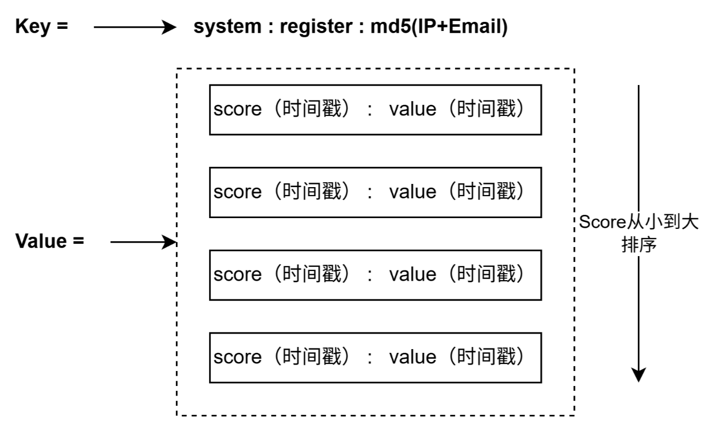

##### 实现思路
假设，现在接口只允许同一个用户 **3 分钟**内只能发送 3 次邮箱验证码。

1. 记录窗口的请求数量

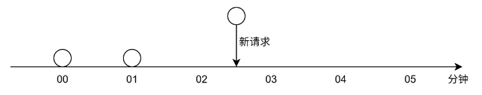

2. 此时，计算`“当前时间”- “3 分钟”内请求的次数 = 2 次 < 3 次`，所以可以发送新请求。

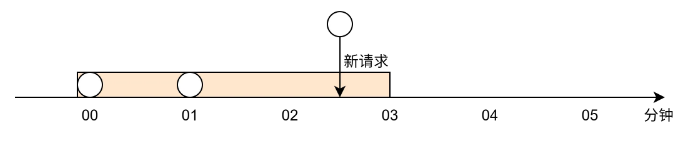

3. 如果，此时在 “3 分钟”时，又新增了请求，由于 3 分钟内请求次数已经超过了 3 次，拒绝请求。

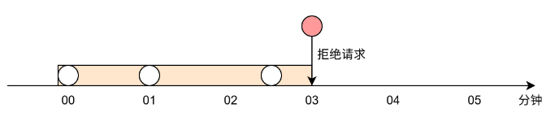

4. 此时，等待了 1 分钟后，再次发送请求
   1. 首先，剔除窗口外的请求（00 分钟）
   2. 计算，`“当前时间”- “3 分钟”内请求的次数 = 2 次`，新增请求。

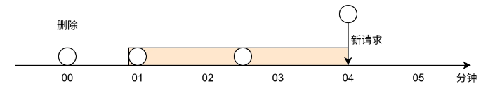

后续的业务，就时不同场景中，根据不同的需求，进行修改校验就行了，比如 5 分钟限流 3 次，10 分钟限流 8 次等。

##### 代码实现
代码实现方面的思路：

1. 基于 Redis 的有序集合 Zset 实现滑动窗口限流（List 集合可以实现滑动窗口）。
2. 目标对象时接口，此时我们就可以使用 AOP 拦截请求，达到限流的目的。

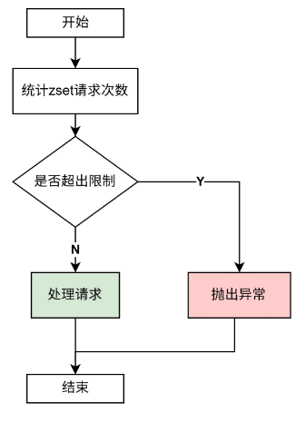

1. 统计接口的请求次数
```java
private boolean isAllow(String key, LimitFlowAnno limitFlowAnno) {
	String luaScript = """
	local key = KEYS[1]
	local current_time = tonumber(ARGV[1])
	local window_size = tonumber(ARGV[2])
	local threshold = tonumber(ARGV[3])

	-- Remove outdated entries
	redis.call('ZREMRANGEBYSCORE', key, 0, current_time - window_size)

	-- Check current count
	local count = redis.call('ZCARD', key)
	if count >= threshold then
	return "0"  -- reject
	end

	-- Allow and record this request
	redis.call('ZADD', key, current_time, current_time)
	redis.call('PEXPIRE', key, window_size)  -- auto-expire the key
	return "1"  -- allow
	""";

	long windowSizeMillis = limitFlowAnno.windowSize() * UNIT;
	long requestLimit = limitFlowAnno.requestLimit();
	long currentTimestamp = System.currentTimeMillis();

	String result = stringRedisTemplate.execute(
		new DefaultRedisScript<>(luaScript, String.class),
		Collections.singletonList(key),
	String.valueOf(currentTimestamp),
	String.valueOf(windowSizeMillis),
	String.valueOf(requestLimit)
	);

	return "1".equals(result);
}
```
2. 自定义注解
```java
@Retention(RetentionPolicy.RUNTIME)
@Target({ElementType.METHOD})
public @interface LimitFlowAnno {
    String behavior() default "";

    /**
     * Time scope, the unit is minute.
     */
    long windowSize() default 1;


    /**
     * Limitation times.
     */
    long requestLimit() default 3;
}
```
3. AOP 限流拦截
```java
@Component
@Aspect
@Slf4j
@Order(2)
public class LimitFlowAop {

	private final long UNIT = 60 * 1000;

	@Resource
	private StringRedisTemplate stringRedisTemplate;

	@Before("@annotation(limitFlowAnno)")
	private void handleBefore(JoinPoint joinPoint, LimitFlowAnno limitFlowAnno) {
		String argJsonStr = JSON.toJSONString(joinPoint.getArgs()[0]);
		HashMap<String, String> requestMap = JsonUtil.jsonStrToObj(argJsonStr, HashMap.class);

		String email = requestMap.get("to");
		String behavior = limitFlowAnno.behavior();
		String key = String.format(RedisKey.LIMIT_FLOW_CAPTCHA_KEY, behavior, email);

		if (isAllow(key, limitFlowAnno)) {
			log.info("请求通过");
		} else {
			throw new BizException(BizCode.CONTROL_FLOW);
		}
	}
}
```

### 找回密码
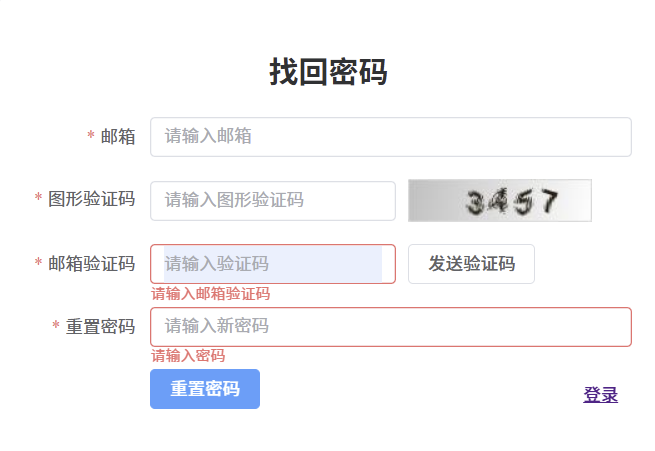

##### 开发思路
1. 用户点击“忘记密码”，输入邮箱； 
2. 系统验证邮箱存在，发送验证码（如 6 位数字）； 
3. 用户输入验证码 + 新密码； 
4. 系统校验验证码，通过后修改密码； 
5. 限制：Redis 限制修改的次数，同一个邮箱一天只能修改 N 次。 
   - key = `limit_reset_password:[邮箱]`
   - value = `次数`
   - 设置过期时间为当天过期

##### 相关代码
1. 修改代码接口：`com/example/system/controller/LoginController--resetPwd()`


--- 
## Reference
1. [基于Redis有序集合实现滑动窗口限流](https://www.cnblogs.com/cjsblog/p/18638536)


