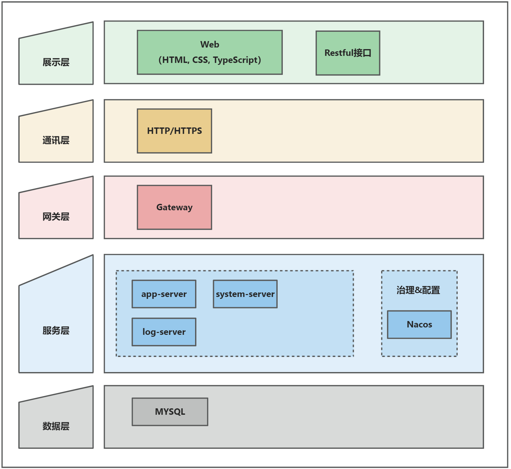

# 通用登录模块

## 目录
- [通用登录模块](#通用登录模块)
   * [目录](#目录)
   * [概述](#概述)
   * [系统架构](#系统架构)

## 概述
这是一个通用登录模块，用于实现用户登录、注册、找回密码等功能。

### 系统架构
架构是由系统组件，以及组件间相互关系共同构成的集合体。
[[1](https://zhuanlan.zhihu.com/p/590957330)]

#### 应用架构

#### 逻辑架构

## 目录结构

## 技术栈
### 前端
| 技术栈              | 描述                                         |
|------------------|--------------------------------------------|
| **Vue 3**        | 现代化渐进式前端框架，支持 Composition API，性能更优，代码更清晰。  |
| **Vue Router**   | Vue 官方的路由管理库，支持动态路由、嵌套路由、懒加载等功能。           |
| **Pinia**        | Vue 3 官方推荐的状态管理库，替代 Vuex，类型推导更好，使用更简单。     |
| **Element Plus** | 基于 Vue 3 的组件库（Element UI 的升级版），提供丰富的 UI 组件。 |
| **TypeScript**   | JavaScript 的超集，提供类型系统和开发时错误提示，提升代码健壮性与可维护性。 |
| **Axios**        | 基于Promise的HTTP库，用于前端与后端的数据交互。              |
| **Nodejs-20**    |                                            |

### 后端
| 技术栈           | 描述                                                   |
| ------------- | ---------------------------------------------------- |
| **Spring Boot 3** | 基于 Spring Framework 的快速开发框架，支持最新 Jakarta EE 标准和原生支持 AOT。 |
| **JDK 17**    | Java LTS（长期支持）版本，提供更强的性能、语法优化和安全特性。                  |
| **Redis**     | 高性能内存数据库，常用于缓存、限流、分布式锁等场景。                           |
| **MySQL**     | 主流关系型数据库，适用于大多数业务场景。                                 |
| **MyBatis-Plus** | MyBatis 的增强版，简化了 CRUD 操作，支持分页、条件构造器等功能。              |
| **Sa-Token**  | 轻量级权限认证框架，支持登录、权限、单点登录、踢人下线、Token 续签等功能。             |

